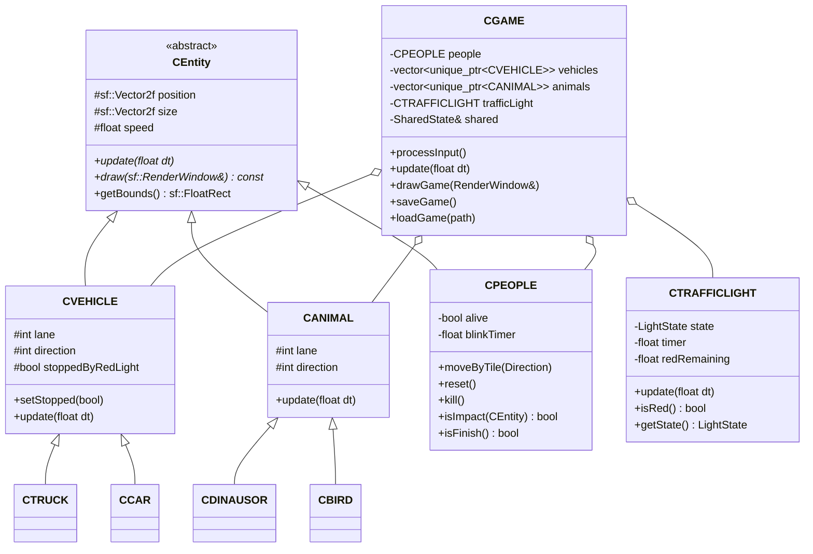

# CrossingGame

Đồ án C++ game 2D "Băng Qua Đường" dùng SFML, thiết kế theo mô hình 2 tiểu trình:

- Main Thread: tạo cửa sổ fixed fullscreen, đọc event bàn phím/menu, ghi input vào trạng thái dùng chung.
- SubThread: cập nhật gameplay, đèn giao thông, va chạm, lên màn, và vẽ frame.

## Build nhanh

1. Cài SFML 2.6.x hoặc đặt SFML vào `third_party/SFML`.
2. Đảm bảo các file DLL nằm cạnh file chạy trong `bin/` hoặc trong `third_party/SFML/bin`.
3. Build:

```powershell
cmake -S . -B build -DSFML_DIR=third_party/SFML/lib/cmake/SFML
cmake --build build --config Release
.\bin\Release\CrossingGame.exe
```

Nếu dùng Visual Studio generator single-config, file chạy có thể nằm ở `bin/CrossingGame.exe`.

## Cây thư mục đề xuất

```text
CrossingGame/
|-- CMakeLists.txt
|-- README.md
|-- bin/                         # file .exe và .dll sau khi build
|-- third_party/
|   `-- SFML/
|       |-- bin/                  # sfml-graphics-2.dll, sfml-window-2.dll...
|       |-- include/
|       `-- lib/
|-- assets/
|   |-- fonts/
|   |-- music/
|   |-- sfx/
|   `-- sprites/
|-- save/                        # file save .sav
|-- include/
`-- src/
```

## UML Class Diagram bằng chữ



Lưu ý: tên `CDINAUSOR` giữ theo yêu cầu đề bài, dù chính tả tiếng Anh thường là `Dinosaur`.
